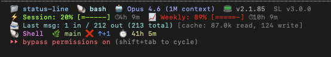

# Claude Code Status Line

A feature-rich status line for [Claude Code](https://docs.anthropic.com/en/docs/claude-code) that displays real-time rate limit usage, git status, project info, and more - right in your terminal.



## Features

- **Per-message token tracking** - Input/output tokens for the last message, with cache read/write breakdown
- **Real-time rate limit tracking** - Session (5h) and weekly (7d) usage percentages with progress bars and countdown timers
- **Color-coded usage warnings** - Green/yellow/red based on usage level
- **Git integration** - Branch name, clean/dirty status, ahead/behind counts
- **Project detection** - Auto-detects project name from git root
- **Language detection** - Identifies primary language from file extensions
- **Session duration** - How long the current session has been running
- **Model & version display** - Shows active model and Claude Code version
- **Context window tracking** - Monitors token usage vs context limit
- **Cost tracking** - Session cost and burn rate ($/hour)
- **Task counter** - Shows active task count
- **Auto-update notifications** - Checks for new versions daily and shows upgrade prompt
- **Performance optimized** - Caching to keep the status line fast
- **No dependencies required** - Works with pure bash; optionally uses `jq` for better JSON parsing

## Installation

### Quick install (recommended)

```bash
curl -sf https://raw.githubusercontent.com/bulgariamitko/claude-code-statusline/main/install.sh | bash
```

This downloads the script, configures `settings.json`, and you're ready to go.

### Manual install

#### 1. Copy the script

```bash
mkdir -p ~/.claude
curl -o ~/.claude/statusline.sh https://raw.githubusercontent.com/bulgariamitko/claude-code-statusline/main/statusline.sh
chmod +x ~/.claude/statusline.sh
```

#### 2. Configure Claude Code

Add this to your `~/.claude/settings.json`:

```json
{
  "statusLine": {
    "type": "command",
    "command": "~/.claude/statusline.sh",
    "padding": 0
  }
}
```

If you already have a `settings.json`, just add the `statusLine` key to it.

#### 3. Restart Claude Code

The status line will appear automatically on your next session.

## Updating

### Quick update

Run the same install command - it will update to the latest version:

```bash
curl -sf https://raw.githubusercontent.com/bulgariamitko/claude-code-statusline/main/install.sh | bash
```

### Auto-update notifications

The status line checks for new versions once per day (in the background, won't slow you down). When an update is available, you'll see:

```
⬆ SL v3.0.0 → v3.1.0
```

Run the install command above to update.

### Version display

The current version is always shown in the status line:

```
SL v3.0.0
```

## What it shows

### Line 1 - Core info
```
📁 project-name  🐚 bash  🤖 Claude Opus 4.6 (1M context)  📟 v2.1.84  SL v3.0.0
```

### Line 2 - Rate limits (appears after first API response)
```
⚡ Session: 42% [===---]  ⏱2h 1m   📈 Weekly: 70% [=====-] ⏱38h 1m
```

### Line 3 - Per-message token usage
```
📨 Last msg: 8.5k in / 1.2k out (9.8k total) [cache: 52.0k read, 3.2k write]
```

### Line 4 - Git, language, session duration
```
🐍 Python  🌿 main ✅  ⏱️ 1h 23m
```

## Rate Limit Data

The status line reads real-time usage data from Claude Code's statusline JSON input:

- **Session (5-hour window)**: `rate_limits.five_hour.used_percentage` + `resets_at`
- **Weekly (7-day window)**: `rate_limits.seven_day.used_percentage` + `resets_at`

This data is provided automatically by Claude Code after the first API response in each session. No manual configuration needed.

## Color Coding

| Usage Level | Color |
|------------|-------|
| < 50% | Green |
| 50-74% | Yellow |
| >= 75% | Red |

## Optional: jq

The script works without `jq` using bash-based JSON parsing, but `jq` provides more reliable extraction. Install it for best results:

```bash
# macOS
brew install jq

# Ubuntu/Debian
sudo apt-get install jq

# Fedora
sudo dnf install jq
```

## Customization

The script is a single bash file - feel free to modify colors, layout, or add/remove sections. Key areas:

- **Colors**: Lines 28-37 define the color palette using ANSI 256-color codes
- **Progress bar**: `progress_bar()` function controls the bar width and characters
- **Cache TTL**: `CACHE_TTL=30` controls how often git/language detection refreshes (seconds)
- **Sections**: Comment out any `printf` block in the render section to hide it

## Requirements

- Claude Code CLI (with statusline support)
- bash 3.2+ (ships with macOS and most Linux distros)
- git (for git integration features)
- Optional: `jq` (for better JSON parsing)

## License

MIT
