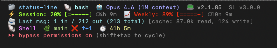

# Claude Code Status Line

A feature-rich status line for [Claude Code](https://docs.anthropic.com/en/docs/claude-code) that displays real-time rate limit usage, git status, project info, and more - right in your terminal.



## Features

- **Reasoning effort** - Live effort level (`low` / `medium` / `high` / `xhigh` / `max`), color-coded, updates on `/effort`
- **Real-time rate limit tracking** - Session (5h) and weekly (7d) usage percentages with progress bars and countdown timers
- **Color-coded usage warnings** - Green/yellow/red based on usage level
- **Token tracking** - Cached tokens for the last request and total tokens in context
- **Git integration** - Branch name, clean/dirty status, ahead/behind counts
- **Session duration** - How long the current session has been running
- **Model & version display** - Shows active model and Claude Code version
- **Auto-update notifications** - Checks for new versions daily and shows upgrade prompt
- **Fast on every platform** - Parses JSON and formats output with bash builtins, calls git once per 30s, so it stays fast even on Windows (Git Bash), where starting a process is slow
- **Cross-platform** - macOS, Linux and Windows (Git Bash)
- **No dependencies required** - Works with pure bash; uses `jq` when available

## Installation

### Quick install (recommended)

```bash
curl -sf https://raw.githubusercontent.com/bulgariamitko/claude-code-statusline/main/install.sh | bash
```

This downloads the script, configures `settings.json`, and you're ready to go.

### Manual install

#### 1. Copy the script

```bash
mkdir -p ~/.claude
curl -o ~/.claude/statusline.sh https://raw.githubusercontent.com/bulgariamitko/claude-code-statusline/main/statusline.sh
chmod +x ~/.claude/statusline.sh
```

#### 2. Configure Claude Code

Add this to your `~/.claude/settings.json`:

```json
{
  "statusLine": {
    "type": "command",
    "command": "~/.claude/statusline.sh",
    "padding": 0
  }
}
```

If you already have a `settings.json`, just add the `statusLine` key to it.

#### 3. Restart Claude Code

The status line will appear automatically on your next session.

## Updating

### Quick update

Run the same install command - it will update to the latest version:

```bash
curl -sf https://raw.githubusercontent.com/bulgariamitko/claude-code-statusline/main/install.sh | bash
```

### Auto-update notifications

The status line checks for new versions once per day (in the background, won't slow you down). When an update is available, you'll see:

```
⬆ SL v3.0.0 → v3.1.0
```

Run the install command above to update.

### Version display

The current version is always shown in the status line:

```
SL v3.0.0
```

## What it shows

### Line 1 - Core info
```
📁 project-name  🤖 Opus 5.5 (1M context)  🧠 high  📟 v2.1.260  SL v3.3.0
```

`🧠` shows the current reasoning effort. It is hidden when the model doesn't support effort.

### Line 2 - Rate limits (appears after first API response)
```
⚡ Session: 42% [==----] ⏱2h 1m  📈 Weekly: 70% [====--] ⏱1d 14h 1m
```

### Line 3 - Tokens, git, session duration
```
📦 Cached: 52.0k  📊 Total: 61.3k  🌿 main ✅  ⏱️ 1h 23m
```

## Rate Limit Data

The status line reads real-time usage data from Claude Code's statusline JSON input:

- **Session (5-hour window)**: `rate_limits.five_hour.used_percentage` + `resets_at`
- **Weekly (7-day window)**: `rate_limits.seven_day.used_percentage` + `resets_at`

This data is provided automatically by Claude Code after the first API response in each session. No manual configuration needed.

## Color Coding

| Usage Level | Color |
|------------|-------|
| < 50% | Green |
| 50-74% | Yellow |
| >= 75% | Red |

## Windows

Claude Code runs status line commands through **Git Bash** on Windows (it ships with [Git for Windows](https://gitforwindows.org/)). Run the quick install command from a Git Bash window. The default `"command": "~/.claude/statusline.sh"` works as is. If you write a full path, use forward slashes (`C:/Users/you/.claude/statusline.sh`), because Git Bash treats backslashes as escape characters.

Emoji render correctly in Windows Terminal. The legacy console (`conhost`) may show boxes instead.

## Optional: jq

The script works without `jq` using bash-based JSON parsing, but `jq` provides more reliable extraction. Install it for best results:

```bash
# macOS
brew install jq

# Ubuntu/Debian
sudo apt-get install jq

# Fedora
sudo dnf install jq

# Arch
sudo pacman -S jq

# Windows
winget install jqlang.jq
```

## Customization

The script is a single bash file - feel free to modify colors, layout, or add/remove sections. Key areas:

- **Colors**: the `c NAME '38;5;N'` block defines the palette using ANSI 256-color codes (set `NO_COLOR=1` to disable colors)
- **Effort colors**: the `case "$effort_level"` block
- **Progress bar**: `progress_bar()` controls the bar characters
- **Cache TTL**: `CACHE_TTL=30` controls how often git info refreshes (seconds)
- **Sections**: each line is built in the render section at the bottom; remove the part you don't want

## Requirements

- Claude Code CLI (with statusline support)
- bash 3.2+ (ships with macOS, Linux distros and Git for Windows)
- git 2.15+ (for git integration features)
- Optional: `jq` (for better JSON parsing)

## License

MIT
